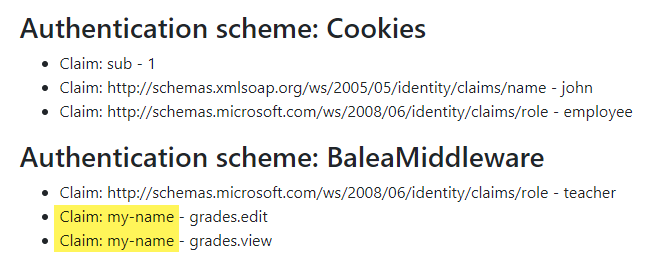

Dealing with claim types map
============================

There is an long history about claim types and the reason why sometimes authorization does not work as we expect. We recommend you to read this awesome `blog post <https://leastprivilege.com/2016/08/21/why-does-my-authorize-attribute-not-work/>`_ about it before continuing reading.  

The problem is basically that Microsoft has its own claim type names for RoleClaimType (http://schemas.microsoft.com/ws/2008/06/identity/claims/role) and NameClaimType (http://schemas.microsoft.com/ws/2008/06/identity/claims/name) and of course its own JWT validation library, which does not follow the more modern standard OpenID Connect claim `types <https://openid.net/specs/openid-connect-core-1_0.html#StandardClaims>`_.

> In `samples/WebApp <https://github.com/Xabaril/Balea/tree/master/sample/WebAppEfCoreOidc>`_ you'll find an example of how to configure the mappings.

Configure the claim types map
-----------------------------

By default, Balea asummes you are within Microsoft roles world. So, Balea will map roles from the authentication system to application roles using the ClaimTypes.Role ``"http://schemas.microsoft.com/ws/2008/06/identity/claims/role"``. To configure the RoleClaimType and NameClaimType on the claim mapping, use the following parameter in the method ``AddBalea``::

        services                     
            .AddBalea(options =>
            {
                options.DefaultClaimTypeMap = new DefaultClaimTypeMap
                {
                    RoleClaimType = JwtClaimTypes.Role
                    NameClaimType = JwtClaimTypes.Name
                };
            })

In this case, Balea will look for roles coming from the authentication system using JwtClaimTypes.Role ``"role"``.

Balea also adds new claim permission to the ```ClaimsIdentity```:

.. image:: ../images/permissions.png

You can change also the name of the claim::

        services                     
            .AddBalea(options =>
            {
                options.DefaultClaimTypeMap = new DefaultClaimTypeMap
                {
                    PermissionClaimType = "my-name"
                };
            })


